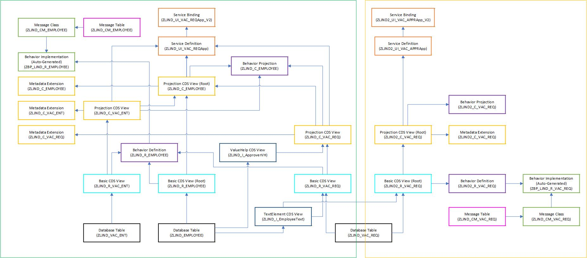

# erp-vacation-management

Dieses Repository dient für das Portfolio in der Vorlesung ERP Anpassung und Entwicklung.

## Offene Anforderungen

Alle offenen Anforderungen stehen als Issues in diesem Repository. Wer eine dieser Anforderungen umsetzen will, soll sich bitte selbst als Bearbeiter zuweisen.

## AppDesign.jpg

Diese Datei ist eine grobe Aufzeichnung der zu erstellenden SAP Fiori Apps (ohne Gewähr). Dabei ist die erste App durch den großen grünen Rahmen und die zweite App durch den großen gelben Rahmen abgegrenzt:

## Namenskonvention für Objekte

Alle Objekte sollen mit dem Kürzel **ZLJND(2)** beginnen:

- **Z** ist Pflichtbestandteil
- **LJND** steht für: Laurenz, Jonas, Niklas, Dominik
- **2** für die 2. App enthalt das Kürzel noch eine 2

### Tabellen

- `ZLJND_EMPLOYEE`
- `ZLJND_VAC_REQ`
- `ZLJND_VAC_ENT`

### Root Views

- `ZLJND_C_EMPLOYEE`
- `ZLJND2_C_VAC_REQ`
